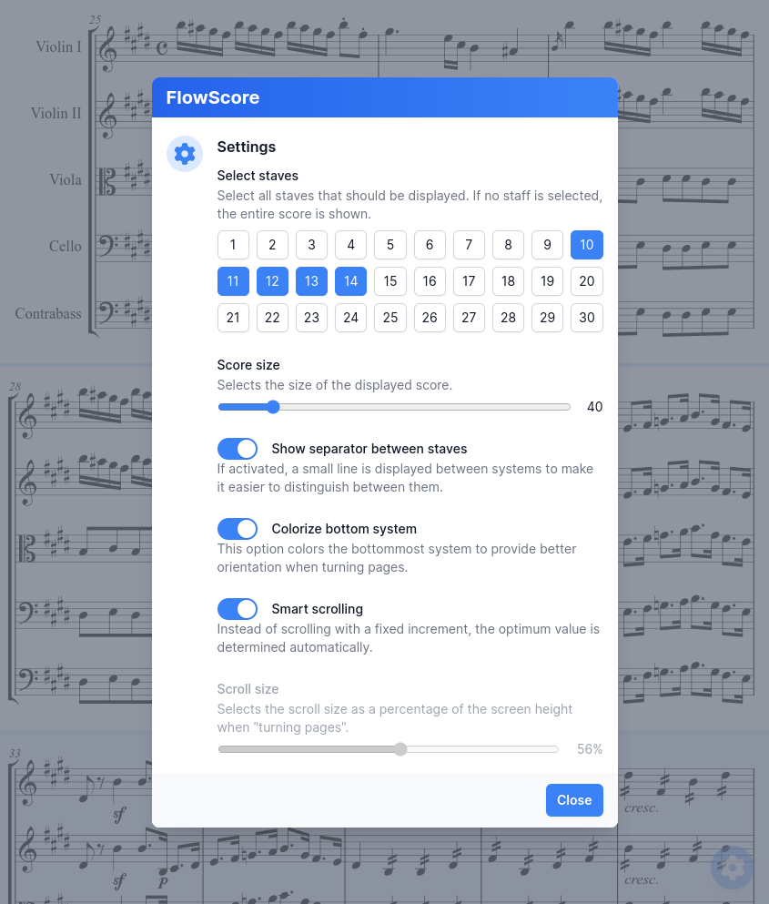

# FlowScore
FlowScore is a web-based score viewer app that enables real-time reception, rendering, and display of musical material on digital music stands.



## 💡 Concept
This project aims to provide a streaming-based solution, divided into three main components: Provider, Server, and Client:

- Provider: Sends musical material to the host. This part is developed externally. (A naive provider that streams MEI files can be found in the /tests folder.)
- Server: Receives musical material from the Music Provider, generates voice parts, and sends them to the clients.
- Client: The client application is accessed by musicians on their devices via a browser. It offers various settings and the display of musical scores.


## 🏎 Build instructions
Only macOS, Linux and WSL are supported for now. ⚠️

1. Make sure to have `bun` installed:
```
$ curl -fsSL https://bun.sh/install | bash
```
2. Run `bun run build` in the root directory of the repo.
3. The resulting executable binary is called `FlowScoreApp`.


## 🛠️️ Run server
To run the server, simply execute the previously built `FlowScoreApp`.

For now the CLI options are restricted to selecting a custom port:
```
$ ./FlowScoreApp --help
FlowScore server v0.1.0 with UI v0.1.0
    Usage: ./FlowScoreApp [OPTIONS]
    Options:
     --port      Set custom port number. Default is 8765.
     --help      Show this help menu.
```

Clients then have to connect to the given IP/Port via HTTP, e.g. `http://192.168.1.1:8765/`.

## Usage


## 📋 Notes for Providers
- WebSocket Connection: Connect to the Server at `ws://[IP]:[Port]?type=provider` using the WebSocket protocol. This connection is used for exchanging data between your provider and the main system.

- Responsibility for Reconnects: As a provider, you are responsible for maintaining your connection. If the connection to the WebSocket server is interrupted for any reason, you must ensure that your provider can automatically reconnect. Therefore, implement a reliable reconnect logic to ensure the stability and reliability of your services.

- Data Format: Ensure that all MEI data you submit is valid.

- Inclusion of Labels: When transmitting MEI data, it is important to include the `@label` and `@label.abbr` attributes in `<scoreDef>` elements **for each MEI snippet**.
- 
- Ignoring MEI header: Note that the server ignores the `<meiHead>` part of the MEI data. This means that any information provided in this section will not be processed or considered.